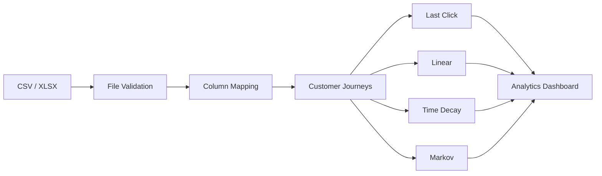

<div align="center">

# <span style="color:#45E083"> Attribyt</span>

### Privacy-first multi-touch attribution for marketing analytics.

Analyze customer journeys and compare different attribution models —
**completely locally, with no cloud or external data sharing.**

<br>


</div>

---


---

## 📌 Overview

Attribyt is a analytics tool for **multi-touch marketing attribution**.

It takes event-level customer journey data and shows how conversion revenue is distributed across marketing channels using different attribution models.

Instead of relying on a single Last-Click metric, Attribyt lets you compare several models side by side:

- **Last Click**
- **Linear**
- **Time Decay**
- **Markov**


---

## ✨ Features

| | Feature | Description |
|---|---|---|
| 📂 | **CSV / XLSX Upload** | Import customer journey data directly into the application. |
| 🔍 | **Automatic Column Mapping** | Detects relevant columns and lets you correct the mapping manually. |
| 🧹 | **Data Validation** | Handles malformed and invalid records before analysis. |
| 📊 | **Multi-Touch Attribution** | Compare four different attribution methodologies. |
| 💰 | **Revenue Attribution** | See how conversion revenue is distributed between channels. |
| 🛣️ | **Converting Paths** | Find the most common channel sequences leading to conversion. |
| 🔒 | **Privacy First** | Data is processed locally inside Docker containers. |
| 📈 | **Analytics Dashboard** | View conversion metrics, revenue and attribution results in one place. |

---

## 🖥️ Application

### 1. Upload & Column Mapping


Attribyt automatically detects the columns required for the analysis and allows them to be adjusted before processing.

Typical fields include:

- Customer ID
- Event timestamp
- Traffic source
- Revenue

---

### 2. Attribution Dashboard


The dashboard provides a high-level overview of the analyzed dataset:

- Users
- Touchpoints
- Conversion rate
- Total revenue
- Average order value

It also visualizes how different attribution models distribute revenue across channels.

---

### 3. Attribution Model Comparison


The same customer journey can produce very different results depending on the attribution methodology.

Attribyt makes this difference visible by comparing all models side by side.

---

## 🧠 Attribution Models

### Last Click

The entire conversion value is assigned to the **last marketing touchpoint** before conversion.

Simple and widely used, but it can overestimate channels that tend to appear at the end of the customer journey.

---

### Linear

The conversion value is distributed **equally between all touchpoints** in the journey.

For example:

```text
Organic → Email → Social → Purchase

25%      + 25%  + 25%   + 25%
```

This gives every touchpoint an equal contribution.

---

### Time Decay

More recent interactions receive **more attribution weight** than earlier interactions.

This model assumes that touchpoints closer to the conversion are generally more influential.

---

### Markov

Attribyt also includes a **Markov-chain based attribution model**.

Instead of simply assigning revenue based on position in the journey, the model analyzes transitions between channels and estimates their contribution using the **removal effect**.

Conceptually:

```text
             ┌─────────┐
             │ Organic │
             └────┬────┘
                  │
                  ▼
             ┌─────────┐
             │  Email  │
             └────┬────┘
                  │
          ┌───────┴───────┐
          ▼               ▼
      ┌────────┐      ┌────────┐
      │ Social │      │ Direct │
      └────┬───┘      └───┬────┘
           │              │
           └──────┬───────┘
                  ▼
             ┌──────────┐
             │Conversion│
             └──────────┘
```

The removal effect measures how much the conversion probability changes when a particular channel is removed from the transition graph.

This makes Markov attribution useful for understanding the **incremental contribution of channels within the entire journey**.

---

## 🔄 How It Works



---

## 📥 Input Data

Attribyt works with event-level customer journey data.

A typical dataset contains:

| Column | Description |
|---|---|
| `client_id` | Unique customer identifier |
| `event_time` | Timestamp of the interaction |
| `traffic_source` | Marketing channel |
| `amount` | Revenue generated by the event |

Example:

```csv
client_id,event_time,traffic_source,amount
1001,2026-01-10 10:15:00,Organic,0
1001,2026-01-11 14:20:00,Email,0
1001,2026-01-12 18:30:00,Social,250
```

The exact column names do not have to match.

They can be mapped to the required fields directly through the UI.

---

## 📊 Example Result


For the included `test_data100.csv` dataset, Attribyt produces the following overview:

| Metric                  |  Value |
| ----------------------- | -----: |
| **Users**               |    100 |
| **Touchpoints**         |    167 |
| **Conversion rate**     | 100.0% |
| **Total revenue**       | $9,951 |
| **Average order value** | $99.51 |

### Attribution by channel

| Channel       | Last Click |    Linear | Time Decay |    Markov |
| ------------- | ---------: | --------: | ---------: | --------: |
| direct        |  $1,890.69 |   $895.59 |  $1,232.03 | $1,162.21 |
| email         |  $1,094.61 | $1,293.63 |  $1,250.98 | $1,419.38 |
| facebook_ads  |  $1,293.63 | $1,476.07 |  $1,421.57 | $1,511.23 |
| google_ads    |  $1,691.67 | $1,874.11 |  $1,791.18 | $1,906.80 |
| organic       |  $2,089.71 | $1,890.69 |  $1,966.51 | $1,539.10 |
| telegram      |  $1,094.61 | $1,310.21 |  $1,222.55 | $1,165.57 |
| yandex_direct |    $796.08 | $1,210.70 |  $1,066.18 | $1,246.71 |

The results show how the estimated contribution of each channel changes depending on the attribution methodology.

For example, **organic** receives the highest Last-Click attribution, while **google_ads** receives the highest Markov attribution among the channels shown. This demonstrates why comparing multiple models can provide a more complete view of channel performance than relying on a single attribution method.


---

## 🎬 Demo

<video controls src="Video Project-1.mp4" title="Title"></video>

---

## 🏗️ Architecture

Attribyt is split into two main applications:

```text
┌───────────────────────────────────────────┐
│                  Frontend                 │
│                                           │
│       React + TypeScript + Vite           │
│                                           │
└───────────────────┬───────────────────────┘
                    │
                    │ HTTP API
                    ▼
┌───────────────────────────────────────────┐
│                  Backend                  │
│                                           │
│              Python + FastAPI             │
│                                           │
│  Validation → Journeys → Attribution      │
│                                           │
└───────────────────────────────────────────┘
                    │
                    ▼
              Local dataset
```

All components are packaged and run using Docker Compose.

---

## 📁 Project Structure

```text
attribyt/
│
├── backend/
│   ├── app/
│   │   ├── __init__.py
│   │   ├── main.py
│   │   └── schemas.py
│   │
│   └── attribution/
│       ├── connectors/
│       │   ├── __init__.py
│       │   └── csv.py
│       │
│       ├── __init__.py
│       ├── base_connector.py
│       ├── file_reader.py
│       ├── journey.py
│       ├── markov.py
│       ├── metrics.py
│       ├── service.py
│       └── validation.py
│
├── frontend/
│   ├── src/
│      ├── assets/
│      │
│      ├── components/
│      │   ├── ColumnMapping.tsx
│      │   ├── FileUpload.tsx
│      │   └── ResultsView.tsx
│      │
│      ├── api.ts
│      ├── App.tsx
│      ├── App.css
│      ├── index.css
│      ├── main.tsx
│      └── types.ts
│   
│      
├── examples/
│   ├── dirty_test_data.csv
│   ├── test_2data100.xlsx
│   └── test_data100.csv
│
├── docker-compose.yml
├── Dockerfile

```

---

## 🛠️ Tech Stack

### Frontend

- React
- TypeScript
- Vite
- CSS

### Backend

- Python
- FastAPI
- Pandas

### Infrastructure

- Docker
- Docker Compose

---

## 🚀 Quick Start

### Requirements

- Docker
- Docker Compose

### Run with Docker

```bash
git clone https://github.com/eapte/attribyt.git
cd attribyt
docker compose up --build
```

Open the application in your browser:

```text
http://localhost:8080
```

Upload one of the example datasets from:

```text
examples/
```

and run the analysis.

---

## 🔒 Privacy

Attribyt follows a **privacy-first, local-first** approach.

Customer journey data is processed locally inside Docker containers.

There is no requirement for:

- cloud analytics services;
- external attribution platforms;
- third-party data processing;
- uploading customer data to an external API.

Your data stays on your machine.

---

## 🧪 Example Datasets

The repository includes sample datasets for testing:

```text
examples/
├── dirty_test_data.csv
├── test_2data100.xlsx
└── test_data100.csv
```

The example files can be used to test:

- column mapping;
- data validation;
- customer journey reconstruction;
- attribution models;
- dashboard visualizations.


## 🗺️ Roadmap

- [ ] Interactive customer journey visualization
- [ ] Configurable attribution windows
- [ ] Export attribution results
- [ ] More detailed conversion funnel analysis
- [ ] Performance improvements for larger datasets

---

## 📄 License

This project is licensed under the **MIT License**.

You are free to use, modify, and distribute the software for personal and commercial purposes.

---

## 🔗 Links

- **Repository:** https://github.com/eapte/attribyt
- **Issues:** https://github.com/eapte/attribyt/issues

--- 