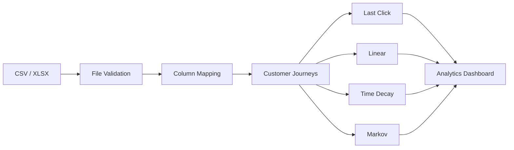

<div align="center">

# <span style="color:#45E083"> Attribyt</span>

### Privacy-first multi-touch attribution for marketing analytics.

Analyze customer journeys and compare different attribution models —
**completely locally, with no cloud or external data sharing.**

<br>


</div>

---


---

## 📌 Overview

Attribyt is an analytics tool for **multi-touch marketing attribution**.

It takes event-level customer journey data and shows how conversion revenue is distributed across marketing channels using different attribution models.

Instead of relying on a single Last-Click metric, Attribyt lets you compare several models side by side:

- **Last Click**
- **Linear**
- **Time Decay**
- **Markov**


---

## Features

- **CSV / XLSX upload** — bring in your own customer journey data
- **Column mapping** — Attribyt guesses which columns are which, but you can fix it if it gets something wrong
- **Data validation** — malformed rows get cleaned up automatically, with a report of what was dropped or fixed
- **Four attribution models** — Last Click, Linear, Time Decay, and Markov (removal effect), so you're not stuck relying on one number
- **Revenue breakdown by channel** and by any custom segment you add (country, device, campaign...)
- **Top converting paths** — see which channel sequences actually lead to purchases
- **Runs locally** — everything happens inside your own Docker containers, nothing leaves your machine
- Multi-currency display (USD, EUR, RUB, GBP)

---

## Application

### 1. Upload & Column Mapping


Attribyt automatically detects the columns required for the analysis and allows them to be adjusted before processing.

Typical fields include:

- Customer ID
- Event timestamp
- Traffic source
- Revenue

---

### 2. Attribution Dashboard


The dashboard provides a high-level overview of the analyzed dataset:

- Users
- Touchpoints
- Conversion rate
- Total revenue
- Average order value

It also visualizes how different attribution models distribute revenue across channels.

---

### 3. Attribution Model Comparison


The same customer journey can produce very different results depending on the attribution methodology.

Attribyt makes this difference visible by comparing all models side by side.

---

## Attribution Models

### Last Click

The entire conversion value is assigned to the **last marketing touchpoint** before conversion.

Simple and widely used, but it can overestimate channels that tend to appear at the end of the customer journey.

---

### Linear

The conversion value is distributed **equally between all touchpoints** in the journey.

For example:

```text
Organic → Email → Social → Purchase

25%      + 25%  + 25%   + 25%
```

This gives every touchpoint an equal contribution.

---

### Time Decay

More recent interactions receive **more attribution weight** than earlier interactions.

This model assumes that touchpoints closer to the conversion are generally more influential.

---

### Markov

Attribyt also includes a **Markov-chain based attribution model**.

Instead of simply assigning revenue based on position in the journey, the model analyzes transitions between channels and estimates their contribution using the **removal effect**.

Conceptually:

```text
             ┌─────────┐
             │ Organic │
             └────┬────┘
                  │
                  ▼
             ┌─────────┐
             │  Email  │
             └────┬────┘
                  │
          ┌───────┴───────┐
          ▼               ▼
      ┌────────┐      ┌────────┐
      │ Social │      │ Direct │
      └────┬───┘      └───┬────┘
           │              │
           └──────┬───────┘
                  ▼
             ┌──────────┐
             │Conversion│
             └──────────┘
```

The removal effect measures how much the conversion probability changes when a particular channel is removed from the transition graph.

This makes Markov attribution useful for understanding the **incremental contribution of channels within the entire journey**.

---

## How It Works



---

## Input Data

Attribyt works with event-level customer journey data.

A typical dataset contains:

| Column | Description |
|---|---|
| `client_id` | Unique customer identifier |
| `event_time` | Timestamp of the interaction |
| `traffic_source` | Marketing channel |
| `amount` | Revenue generated by the event |

Example:

```csv
client_id,event_time,traffic_source,amount
1001,2026-01-10 10:15:00,Organic,0
1001,2026-01-11 14:20:00,Email,0
1001,2026-01-12 18:30:00,Social,250
```

The exact column names do not have to match.

They can be mapped to the required fields directly through the UI.

---

## Example Result


For the included `test_data100.csv` dataset, Attribyt produces the following overview:

| Metric                  |  Value |
| ----------------------- | -----: |
| **Users**               |    100 |
| **Touchpoints**         |    267 |
| **Conversion rate**     | 100.0% |
| **Total revenue**       | $9,951 |
| **Average order value** | $99.51 |

### Attribution by channel

| Channel       | Last Click |    Linear | Time Decay |    Markov |
| ------------- | ---------: | --------: | ---------: | --------: |
| direct        |  $2,300    | $1,471.67 |  $1,950.29 | $1,161.61 |
| email         |  $1,040.05 | $1,171.29 |  $1,098.83 | $1,462.64 |
| facebook_ads  |  $1,340    | $1,421.67 |  $1,379.67	| $1,555.78 |
| google_ads    |  $1,550.05 | $1,775.42 |  $1,625.52 | $1,881.03 |
| organic       |  $1,750    | $1,605.83 |  $1,709.38 | $1,521.8  |
| telegram      |  $1,070    | $1,257.21 |  $1,138.27 | $1,159.45 |
| yandex_direct |  $900      | $1,247.92 |  $1,049.05 | $1,208.69 |

The results show how the estimated contribution of each channel changes depending on the attribution methodology.

For example, **organic** receives the highest Last-Click attribution, while **google_ads** receives the highest Markov attribution among the channels shown. This demonstrates why comparing multiple models can provide a more complete view of channel performance than relying on a single attribution method.


---

## Demo


---

## Architecture

```text
┌──────────────────────────┐
│         Frontend         │
│                          │
│ React + TypeScript + Vite│
│         Recharts         │
└────────────┬─────────────┘
             │
          HTTP API
             │
             ▼
┌──────────────────────────┐
│         Backend          │
│                          │
│ Python + FastAPI         │
│ Uvicorn + Polars         │
└────────────┬─────────────┘
             │
             ▼
┌──────────────────────────┐
│     Data Processing      │
│                          │
│ File Reading             │
│ Validation               │
│ Customer Journeys        │
│ Attribution Models       │
└────────────┬─────────────┘
             │
             ▼
       Analysis Results
```

Everything runs locally using Docker Compose.  
No cloud infrastructure or external data sharing is required.

---

## Project Structure

```text
attribyt/
│
├── backend/
│   ├── app/
│   │   ├── __init__.py
│   │   ├── main.py
│   │   └── schemas.py
│   │
│   └── attribution/
│       ├── connectors/
│       │   ├── __init__.py
│       │   └── csv.py
│       │
│       ├── __init__.py
│       ├── base_connector.py
│       ├── file_reader.py
│       ├── journey.py
│       ├── markov.py
│       ├── metrics.py
│       ├── service.py
│       └── validation.py
│
├── frontend/
│   ├── src/
│      ├── assets/
│      │
│      ├── components/
│      │   ├── ColumnMapping.tsx
│      │   ├── FileUpload.tsx
│      │   └── ResultsView.tsx
│      │
│      ├── api.ts
│      ├── App.tsx
│      ├── App.css
│      ├── index.css
│      ├── main.tsx
│      └── types.ts
│   
│      
├── examples/
│   ├── dirty_test_data.csv
│   ├── test_2data100.xlsx
│   └── test_data100.csv
│
├── docker-compose.yml

```

---

## Tech Stack

### Frontend

- React
- TypeScript
- Vite
- CSS

### Backend

- Python
- FastAPI
- Polars

### Infrastructure

- Docker
- Docker Compose

---

## Quick Start

### Requirements

- Docker
- Docker Compose

### Run with Docker

```bash
git clone https://github.com/eapte/attribyt.git
cd attribyt
docker compose up --build
```

Open the application in your browser:

```text
http://localhost:8080
```

Upload one of the example datasets from:

```text
examples/
```

and run the analysis.

---

## Privacy

Attribyt follows a **privacy-first, local-first** approach.

Customer journey data is processed locally inside Docker containers.

There is no requirement for:

- cloud analytics services;
- external attribution platforms;
- third-party data processing;
- uploading customer data to an external API.

Your data stays on your machine.

---

## Example Datasets

The repository includes sample datasets for testing:

```text
examples/
├── dirty_test_data.csv
├── test_2data100.xlsx
└── test_data100.csv
```

The example files can be used to test:

- column mapping;
- data validation;
- customer journey reconstruction;
- attribution models;
- dashboard visualizations.

---

## License

This project is licensed under the **MIT License**.

You are free to use, modify, and distribute the software for personal and commercial purposes.

---

## Links

- **Repository:** https://github.com/eapte/attribyt
- **Issues:** https://github.com/eapte/attribyt/issues

--- 
